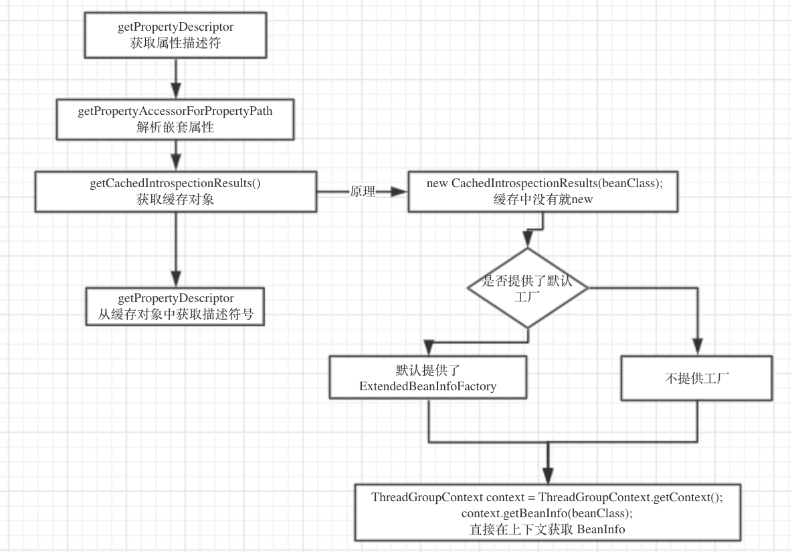

## 对bean的包装

### 1.前言

为什么先从对bean的包装开始阅读源码呢，因为beans包的核心就是`BeanFactory` 🐶，其作用就是对bean进行管理，那么对bean管理的前提就是对bean进行解析，然后支持属性的`set` 或 `get` 操作。那么我们列举一下`BeanFactory`的主要职责，即使没阅读过源码，也应该知道个大概过程.

+ 解析`xml`或者其它配置文件得到 `BeanDefinition`
+ 实例化 `Instance`
+ `AutoWired`自动装配 `Bean`的依赖

**所以，我们先了解如何去得到一个Bean的 “定义” (解析xml那部分先不讲)**

### 2. `BeanWrapper` 

```tex
这个类的主要作用是解析`Class` 然后获取属性，进一步封装，然后提供修改属性的接口
```

```java
public interface BeanWrapper extends ConfigurablePropertyAccessor {
  // 设置集合属性自增长的长度
	void setAutoGrowCollectionLimit(int autoGrowCollectionLimit);
	
  // 获取当前集合属性自增长的长度
	int getAutoGrowCollectionLimit();
	
	// 获取包装的Bean的Instance
	Object getWrappedInstance();
	
	// 获取Bean的Class
	Class<?> getWrappedClass();
	
	// 获取所有属性描述符
	PropertyDescriptor[] getPropertyDescriptors();
  
  // 获取属性描述符
	PropertyDescriptor getPropertyDescriptor(String propertyName) throws InvalidPropertyException;

}
```


为什么上面会涉及到**集合**，因为`Bean` 支持`nested (嵌套)` 属性读写，也就是`pojo`

```properties
bean.setValue("bean.child.attr", 1)
```

### 3. 下面看一下`BeanWrapper`的实现类，`BeanWrapperImpl`

1. 我们从其测试代码中可以看到这样的用法

   

   ```java
   GetterBean target = new GetterBean();
   BeanWrapper accessor = createAccessor(target);
   accessor.setPropertyValue("name", "tom");
   assertThat(target.getAliasedName()).isEqualTo("tom");
   assertThat(accessor.getPropertyValue("aliasedName")).isEqualTo("tom");
   ```

   ```java
   protected BeanWrapperImpl createAccessor(Object target) {
   		return new BeanWrapperImpl(target);
   	}
   ```

   我们可以看到 `createAccessor` 就是`new BeanWrapperImpl`就完成对`Bean`的封装了， 就可以调用

   - `setPropertyValue`  设置属性值
   - `getPropertyValue`  获取属性值

2. 初步看下 `BeanWrapperImpl`的`UML` (不用纠结 `UML` 后面会人肉其运行过程) :happy:

   

   

   
   
   **在上面这个图中，着重 `AbstractNesablePropertyAccessor`** 此类是用于支持上文提到的`Nested` 嵌套属性读写.
   
3. `getPropertyDescriptor` 获取属性描述符

   ```java
   public PropertyDescriptor getPropertyDescriptor(String propertyName) throws InvalidPropertyException {
   		// [1] 先解析嵌套属性，获取最后一个属性的Instance
   		BeanWrapperImpl nestedBw = (BeanWrapperImpl) getPropertyAccessorForPropertyPath(propertyName);
   		String finalPath = getFinalPath(nestedBw, propertyName);
   		// [2] 然后直接获取属性描述符
   		PropertyDescriptor pd = nestedBw.getCachedIntrospectionResults().getPropertyDescriptor(finalPath);
   		if (pd == null) {
   			throw new InvalidPropertyException(getRootClass(), getNestedPath() + propertyName,
   					"No property '" + propertyName + "' found");
   		}
   		return pd;
   	}
   ```

   + 刚才我们说过其支持`nested` 嵌套属性，如果我们传入的`propertyName` 为 `bean.child.name` ，我们就要先拿到 `bean` 然后再拿到 `child` 最后拿到 `name` 然后才能返回类型描述符. ​ :warning: 第一步我们先不管

   + 然后第二步 `getCachedIntrospectionResults#getPropertyDescriptor()` 来获取属性描述符

   + `CachedIntrospectionResults` 中包含 `PropertyDescriptor` 信息，跟下去

     

     ```java
     private CachedIntrospectionResults getCachedIntrospectionResults() {
        	// [1] 判断是不是有缓存了
     		if (this.cachedIntrospectionResults == null) {
           // [2] 缓存中没有那就 new
     			this.cachedIntrospectionResults = CachedIntrospectionResults.forClass(getWrappedClass());
     		}
     		return this.cachedIntrospectionResults;
     	}
     ```

     继续跟。

     ```java
     static CachedIntrospectionResults forClass(Class<?> beanClass) throws BeansException {
     		// [1] 从一级缓存中获取
     		CachedIntrospectionResults results = strongClassCache.get(beanClass);
     		if (results != null) {
     			return results;
     		}
     
     		// [2] 从二级缓存中获取
     		results = softClassCache.get(beanClass);
     		if (results != null) {
     			return results;
     		}
     
     		// [3] 如果都没有，则New一个, 核心还是在这
     		results = new CachedIntrospectionResults(beanClass);
     		ConcurrentMap<Class<?>, CachedIntrospectionResults> classCacheToUse;
     
     		// [4] 判断使用一级缓存还是二级缓存
     		// 经调试，发现spring用的是一级缓存
     		if (ClassUtils.isCacheSafe(beanClass, CachedIntrospectionResults.class.getClassLoader()) ||
     				isClassLoaderAccepted(beanClass.getClassLoader())) {
     			classCacheToUse = strongClassCache;
     		}
     		else {
     			if (logger.isDebugEnabled()) {
     				logger.debug("Not strongly caching class [" + beanClass.getName() + "] because it is not cache-safe");
     			}
     			classCacheToUse = softClassCache;
     		}
     
     		// [5] 将新New的放入缓存
     		CachedIntrospectionResults existing = classCacheToUse.putIfAbsent(beanClass, results);
     		return (existing != null ? existing : results);
     	}
     ```

     可以看到`spring` 很善用缓存，这里可以看到，其用了两个缓存 `strongClassCache` 和 `softClassCache`

     ```java
       /* [DESC] 一级缓存*/
     	static final ConcurrentMap<Class<?>, CachedIntrospectionResults> strongClassCache =
     			new ConcurrentHashMap<>(64);
     
     	/* [DESC] 二级缓存 又称为 SoftCache，因为采用弱引用MAP，所以缓存元素长时间未使用则会被回收*/
     	static final ConcurrentMap<Class<?>, CachedIntrospectionResults> softClassCache =
     			new ConcurrentReferenceHashMap<>(64);
     ```

     **虽然其设置了两层缓存，但实际只用到了 `strongClassCache`** 因为属性这些会常驻内存，所以不需要使用弱引用的`Map`,实际上控制使用那个缓存是`isCacheSafe` 来控制的, 继续跟 :hammer:我是最强人肉王子

     ```java
     public static boolean isCacheSafe(Class<?> clazz, @Nullable ClassLoader classLoader) {
        Assert.notNull(clazz, "Class must not be null");
        try {
           // [1] 获取该类的ClassLoader
           ClassLoader target = clazz.getClassLoader();
           // Common cases
     
           // [2] 如果目标类的ClassLoader == 提供的classLoader
           // [NOTICE] 双亲委派原则，只有使用同一个类加载器，加载的数据才能是只有一份，这个缓存才是是有效的
           if (target == classLoader || target == null) {
              return true;
           }
           if (classLoader == null) {
              return false;
           }
           // [3] 递归classLoader的祖先
           // Check for match in ancestors -> positive
           ClassLoader current = classLoader;
           while (current != null) {
              current = current.getParent();
              if (current == target) {
                 return true;
              }
           }
           
           // [4] 递归目标的祖先
           // Check for match in children -> negative
           while (target != null) {
              target = target.getParent();
              if (target == classLoader) {
                 return false;
              }
           }
        }
        catch (SecurityException ex) {
           // Fall through to loadable check below
        }
     
        // Fallback for ClassLoaders without parent/child relationship:
        // safe if same Class can be loaded from given ClassLoader
        return (classLoader != null && isLoadable(clazz, classLoader));
     }
     ```

     **这里判断cache是否安全的原理是** ，根据`双亲委派` 机制，因为一个类被一个加载器加载一次在内存中就会有一份`Class` , 如果它们的加载器是一样的，那么得到的`Class` 也是一致的，这样才能确保，我们拿到的目标`Class` 数据是正确的。

     解析完这个，我们继续上面的，如果从缓存拿不到则 `new`

     ```java
     results = new CachedIntrospectionResults(beanClass);
     ```

     ```java
     private CachedIntrospectionResults(Class<?> beanClass) throws BeansException {
     		try {
     			if (logger.isTraceEnabled()) {
     				logger.trace("Getting BeanInfo for class [" + beanClass.getName() + "]");
     			}
     			// 关注 #getBeanInfo
     			this.beanInfo = getBeanInfo(beanClass);
     ```

     ```java
     private static BeanInfo getBeanInfo(Class<?> beanClass) throws IntrospectionException {
        // [1] 尝试从加载的工厂中获取BeanInfo
        // 实际上，spring.beans 只提供一个工厂，而且那个工厂也是从线程上下文中获取
        // 所以一定能拿到，这是为了防止spring.beans没有提供工厂而考虑到的细节
        for (BeanInfoFactory beanInfoFactory : beanInfoFactories) {
           BeanInfo beanInfo = beanInfoFactory.getBeanInfo(beanClass);
           if (beanInfo != null) {
              return beanInfo;
           }
        }
     
        // [2] 如果不提供工厂或者工厂不存在，直接在线程上下文中获取
        return (shouldIntrospectorIgnoreBeaninfoClasses ?
              Introspector.getBeanInfo(beanClass, Introspector.IGNORE_ALL_BEANINFO) :
              Introspector.getBeanInfo(beanClass));
     }
     ```

     在`CachedIntrospectionResults` 中，它会加载一个 `factory`

     ```java
     /** [DESC]  在这里加载BeanInfoFactory*/
     // 加载 "META-INF/spring.factories" 中指定的工厂类
     private static List<BeanInfoFactory> beanInfoFactories = SpringFactoriesLoader.loadFactories(
           BeanInfoFactory.class, CachedIntrospectionResults.class.getClassLoader());
     ```

     ```properties
     org.springframework.beans.BeanInfoFactory=org.springframework.beans.ExtendedBeanInfoFactory
     ```

     发现了，它的默认工厂类是 `ExtendedBeanInfoFactory`

     接下来继续看，如果工厂类中不存在 `BeanInfo`则会调用 `Introspector#getBeanInfo()`

     ```java
     public static BeanInfo getBeanInfo(Class<?> beanClass)
             throws IntrospectionException
         {
             if (!ReflectUtil.isPackageAccessible(beanClass)) {
                 return (new Introspector(beanClass, null, USE_ALL_BEANINFO)).getBeanInfo();
             }
       			// 从线程上下文获取已经加载的 Class 信息
             ThreadGroupContext context = ThreadGroupContext.getContext();
             BeanInfo beanInfo;
             synchronized (declaredMethodCache) {
                 beanInfo = context.getBeanInfo(beanClass);
             }
             if (beanInfo == null) {
                 beanInfo = new Introspector(beanClass, null, USE_ALL_BEANINFO).getBeanInfo();
                 synchronized (declaredMethodCache) {
                     context.putBeanInfo(beanClass, beanInfo);
                 }
             }
             return beanInfo;
         }
     ```

     到此就不用追了，这里已经是jdk了，实际上是从 `线程上下文`获取的 `BeanInfo` ，这也证明了 `BeanFactory` 用的是 `线程上下文加载器` 

     **其实上面的 默认工厂 ExtendedBeanInfoFactory** 用的也是`上下文加载器`

     ```java
     public class ExtendedBeanInfoFactory implements BeanInfoFactory, Ordered {
     
        /**
         * Return an {@link ExtendedBeanInfo} for the given bean class, if applicable.
         */
        @Override
        @Nullable
        public BeanInfo getBeanInfo(Class<?> beanClass) throws IntrospectionException {
           return (supports(beanClass) ? new ExtendedBeanInfo(Introspector.getBeanInfo(beanClass)) : null);
        }
     ```

     **总结下，以免跟得太深，回溯不了**

     

     

     **目前为止，我们也只是拿到了 `BeanInfo`**

     回到 `new CachedIntrospectionResults` 的地方，我们首先已经有了 `BeanInfo`

     ```java
     private CachedIntrospectionResults(Class<?> beanClass) throws BeansException {
        try {
           // 关注 #getBeanInfo
           this.beanInfo = getBeanInfo(beanClass);
     
           this.propertyDescriptorCache = new LinkedHashMap<>();
     
           // [1] 直接获取BeanInfo的 {@link PropertyDescriptor}
           PropertyDescriptor[] pds = this.beanInfo.getPropertyDescriptors();
           for (PropertyDescriptor pd : pds) {
              // [2] 某些属性是被保护的，则跳过
              if (Class.class == beanClass &&
                    ("classLoader".equals(pd.getName()) ||  "protectionDomain".equals(pd.getName()))) {
                 continue;
              }
              // [3] 将{@link PropertyDescriptor} 转换为 {@link GenericTypeAwarePropertyDescriptor}
              pd = buildGenericTypeAwarePropertyDescriptor(beanClass, pd);
              // [4] 丢入缓存
              this.propertyDescriptorCache.put(pd.getName(), pd);
           }
     
           // [5] 还得判断这些方法是不是java8的接口的默认方法
           Class<?> currClass = beanClass;
           while (currClass != null && currClass != Object.class) {
              introspectInterfaces(beanClass, currClass);
              currClass = currClass.getSuperclass();
           }
           this.typeDescriptorCache = new ConcurrentReferenceHashMap<>();
        }
        
     }
     ```

     直接从 `BeanInfo` 拿到属性描述符，并且缓存起来，现在我们就完成了获取 `BeanInfo` 部分了，那么剩下的就是根据拿到的 `PropertyDescriptor` 去读写 `Property` :wink:

4. `getPropertyAccessorForPropertyPath`

   在上面的`getPropertyDescriptor`中用到了这个方法去解析 `nested` 嵌套属性，下面就来看下它怎么实现的

   首先我们得明确一件事情，`BeanWrapperImp` 继承自 `AbstractNestablePropertyAccessor` 因为 `BeanWrapperImp` 携带有 `Instance` ，所以 `AbstractNestablePropertyAccessor` 必然也携带有 `Instance` ，那按照我们的思路该如何解析 `nested` 属性呢，比如 有一个`Bean`

   ```java
   class Student{
     private name;
     private Clazz clazzInfo;
   }
   class Clazz{
     private Integer id;
   }
   ```

   这个我们需要取出其`ClazzId`，用`nested` 表示就是 `clazzInfo.id` ，那我们该如何解析，首先找到第一个属性

   `clazzInfo`，然后从`Student`中获取 `clazzInfo` 的`Instance` ，然后在解析第二个属性 `id` ，然后再在`classInfo` 中拿到 `id` 的值，这显然是一个递归。

   下面来看实现:

   ```java
   protected AbstractNestablePropertyAccessor getPropertyAccessorForPropertyPath(String propertyPath) {
      // [1] 解析出第一个属性的分割索引
      int pos = PropertyAccessorUtils.getFirstNestedPropertySeparatorIndex(propertyPath);
    
   ```

   **首先看第一步**：`PropertyAccessorUtils.getFirstNestedPropertySeparatorIndex`

   ```java
   private static int getNestedPropertySeparatorIndex(String propertyPath, boolean last) {
      // [1] map[my.key] 这种就无法解析，因为它是按顺序解析的
      // 如果属性是一个数组 value[1].x，它就解析出 value[1]
      boolean inKey = false;
      int length = propertyPath.length();
      int i = (last ? length - 1 : 0);
      while (last ? i >= 0 : i < length) {
         switch (propertyPath.charAt(i)) {
             // "["
            case PropertyAccessor.PROPERTY_KEY_PREFIX_CHAR:
             // "]"
            case PropertyAccessor.PROPERTY_KEY_SUFFIX_CHAR:
               // 忽略[.] 中的 dots
               inKey = !inKey;
               break;
             // "."
            case PropertyAccessor.NESTED_PROPERTY_SEPARATOR_CHAR:
             // 确保这个 "." 不是在 [] 里面
               if (!inKey) {
                  // 不在[]里面的 . 说明就找到了分隔符
                  return i;
               }
         }
         if (last) {
            i--;
         }
         else {
            i++;
         }
      }
      return -1;
   }
   ```

   可以看出`nested`不仅支持`普通类型`和`pojo` ，还支持 `map` 和 `list` 集合，但支持度最终有限，比如说这种形式它就不支持 `map[child.name]` , `[]` 中带 `.` 是不支持的。 

   从上面可以看出，其遇到 `.` 就直接返回了，所以说 当我们输入 `child[1].name` 和 `child.name` ，它返回的都是 `.`的位置，那么我们继续跟踪上面.

   ```java
    protected AbstractNestablePropertyAccessor getPropertyAccessorForPropertyPath(String propertyPath) {
      // [1] 解析出第一个属性的分割索引
      int pos = PropertyAccessorUtils.getFirstNestedPropertySeparatorIndex(propertyPath);
      if (pos > -1) {
         // [2] 获取第一个属性名
         String nestedProperty = propertyPath.substring(0, pos);
         // 剩下的路径, 递归
         String nestedPath = propertyPath.substring(pos + 1);
         // [3] 根据属性名获取 accessor
         AbstractNestablePropertyAccessor nestedPa = getNestedPropertyAccessor(nestedProperty);
         // [4] 继续递归 nested path
         return nestedPa.getPropertyAccessorForPropertyPath(nestedPath);
      }
      else {
         return this;
      }
   }
   ```

   **接着看第二步**，就是根据 `.` 的位置分隔出属性的名字

   + 如果输入 `bean[1].name` 那么获取的属性名就应该是 `bean[1]`，那么剩下的路径就是`name`了; 

   + 如果输入 `bean.name` ，那么获取的属性名就是`bean` ，剩下的路径就是 `name`

     

   **第三步**, 拿到属性名怎么做？那不就是调用 `getProperty` 拿到`Instance`吗，在这里它封装了一下，职责进行了分离.

   + `AbstractNestablePropertyAccessor` 用于解析出 `属性名`
   + `PropertyHandler` 用于读写`属性值`
   + `PropertyTokenHolder` 对属性名进行封装，因为如果属性是集合类型 `bean[1]` 这个还是需要再解析的，所以使用一个 `Token` 来描述解析出来的`属性`

   了解了职责分离，理解起来就简单了，我们继续第三步

   ```java
   AbstractNestablePropertyAccessor nestedPa = getNestedPropertyAccessor(nestedProperty);
   ```

   ```java
   private AbstractNestablePropertyAccessor getNestedPropertyAccessor(String nestedProperty) {
      if (this.nestedPropertyAccessors == null) {
         this.nestedPropertyAccessors = new HashMap<>();
      }
      // [1] 首先生成 token
      PropertyTokenHolder tokens = getPropertyNameTokens(nestedProperty);
      String canonicalName = tokens.canonicalName;
   
      // [2] 从Instance中获取值
      Object value = getPropertyValue(tokens);
   
      // [3] 如果值为空，则判断是不是支持集合类型的数据，是集合类型数据就 new 一个空集合
      if (value == null || (value instanceof Optional && !((Optional<?>) value).isPresent())) {
         if (isAutoGrowNestedPaths()) {
            // 这里设置一个默认值，也就是 new ArrayList 或者 HashMap
            value = setDefaultValue(tokens);
         }
         else {
            // 不支持集合类型那就报异常洛
            throw new NullValueInNestedPathException(getRootClass(), this.nestedPath + canonicalName);
         }
      }
   
      // [4] 将其Instance交给 AbstractNestablePropertyAccessor ，因为它是负责操作Instance的
      // 先尝试从缓存中找
      AbstractNestablePropertyAccessor nestedPa = this.nestedPropertyAccessors.get(canonicalName);
      if (nestedPa == null || nestedPa.getWrappedInstance() != ObjectUtils.unwrapOptional(value)) {
         // [5] 找不到则 new 一个
         nestedPa = newNestedPropertyAccessor(value, this.nestedPath + canonicalName + NESTED_PROPERTY_SEPARATOR);
   
         // 继承属性编辑器
         copyDefaultEditorsTo(nestedPa);
         copyCustomEditorsTo(nestedPa, canonicalName);
   
         // 别忘记丢进缓存
         this.nestedPropertyAccessors.put(canonicalName, nestedPa);
      }
      return nestedPa;
   }
   ```

   1. 根据传进来的属性名创建`token`

      ```java
      private PropertyTokenHolder getPropertyNameTokens(String propertyName) {
         /**------------------------------------------------------------------------------------------------------------
          * [DESC] 实际用途就是用来解析集合类型的嵌套属性然后封装成token
          * 1. bean[1].name
          * 2. bean[1][2].name
          * 3. bean["key"].x
          * 4. bean['key'].y
          *------------------------------------------------------------------------------------------------------------*/
      
         String actualName = null;
         List<String> keys = new ArrayList<>(2);
         int searchIndex = 0;
         while (searchIndex != -1) {
            // [1] 先找出 [ 的位置
            int keyStart = propertyName.indexOf(PROPERTY_KEY_PREFIX, searchIndex);
            searchIndex = -1;
            if (keyStart != -1) {
               // [2] 再找 ] 的位置
               int keyEnd = getPropertyNameKeyEnd(propertyName, keyStart + PROPERTY_KEY_PREFIX.length());
               if (keyEnd != -1) {
                  if (actualName == null) {
                     // [3] 获取属性名
                     actualName = propertyName.substring(0, keyStart);
                  }
                  // [4] 把key取出来，如果是 "key" 或者 'key' 那就把前缀去掉
                  String key = propertyName.substring(keyStart + PROPERTY_KEY_PREFIX.length(), keyEnd);
                  if (key.length() > 1 && (key.startsWith("'") && key.endsWith("'")) ||
                        (key.startsWith("\"") && key.endsWith("\""))) {
                     key = key.substring(1, key.length() - 1);
                  }
                  // 把key丢进去
                  keys.add(key);
      
                  // [5] 因为支持多维数组，所以继续 ， example = bean[key][1]
                  searchIndex = keyEnd + PROPERTY_KEY_SUFFIX.length();
               }
            }
         }
      
         // [6] 创建token
         PropertyTokenHolder tokens = new PropertyTokenHolder(actualName != null ? actualName : propertyName);
      
         // [7] keys不为空，
         if (!keys.isEmpty()) {
            // 规范名称，貌似这个用不到
            tokens.canonicalName += PROPERTY_KEY_PREFIX +
                  StringUtils.collectionToDelimitedString(keys, PROPERTY_KEY_SUFFIX + PROPERTY_KEY_PREFIX) +
                  PROPERTY_KEY_SUFFIX;
            tokens.keys = StringUtils.toStringArray(keys);
         }
         return tokens;
      }
      ```

      这个算法很简单，值得关注的地方是用于确定 `]`位置的方法 `getPropertyNameKeyEnd`

      因为当传入进来的 `nested` 值是 `map[map[key]]` 的时候，`spring不支持这种写法` ，我怎么知道？看下面的方法实现你就知道了。

      ```java
      private int getPropertyNameKeyEnd(String propertyName, int startIndex) {
         /**---------------------------------------------------------------------------
          * [DESC] 其作用也就是确认 ] 的位置，需要考虑的问题是
          * 1. beans[child[2]] 那么我们应该取最外层的 ] 的位置
          * 2. 因为 spring 不支持上面这种写法，它会把 child[2] 当成字符串，当成beans的key
          *----------------------------------------------------------------------------*/
         int unclosedPrefixes = 0;
         int length = propertyName.length();
         for (int i = startIndex; i < length; i++) {
            switch (propertyName.charAt(i)) {
               // [1] 如果遇到了 [ 则 unclosedPrefixes++,用于判断进入了多少层的 [] 
               case PropertyAccessor.PROPERTY_KEY_PREFIX_CHAR:
                  // The property name contains opening prefix(es)...
                  unclosedPrefixes++;
                  break;
                  
                  // [2] 如果遇到了 ]
               case PropertyAccessor.PROPERTY_KEY_SUFFIX_CHAR:
                  // unclosedPrefixes == 0 说明这是最外层的 ]
                  if (unclosedPrefixes == 0) {
                     // 最外层直接返回
                     // No unclosed prefix(es) in the property name (left) ->
                     // this is the suffix we are looking for.
                     return i;
                  }
                  else {
                     // 否则不是最外层的 ] ,unclosedPrefixed -- 表示退出一层，继续寻找外一层的 ]
                     unclosedPrefixes--;
                  }
                  break;
            }
         }
         return -1;
      }
      ```

      因为这个方法是拿到最外层 `]` 的位置，所以，我们拿到的`key` 也只能拿最外层，所以即使你有多层`key`，它也只识别一层, 例如：`beans[map[key]]` 它只能识别出 `beans` 是一个 `map` ，而 `map[key]` 当成是一个字符串作为 `beans ` 的一个 `key` 处理

   2. 根据`token`获取该属性的 `Instance`

      在上面 解析中，我们已经拿到了`token` ，我们知道 `token` 里面包含了`属性名`和 `keys` ，接下来就能通过`属性名`拿到`属性值了`

      ```java
       Object value = getPropertyValue(tokens);
      ```

      ```java
      protected Object getPropertyValue(PropertyTokenHolder tokens) throws BeansException {
         String propertyName = tokens.canonicalName;
         String actualName = tokens.actualName;
         // [1] 直接获取 handler,handler用于访问属性
         PropertyHandler ph = getLocalPropertyHandler(actualName);
      ```

      上面提到过，`PropertyHandler` 是用于访问属性的，职责分离嘛，所以再拿到`token` 后，就可以获取 `Handler`了。这个方法的实现是在`BeanWrapperImpl#getLocalPropertyHandler`中实现的。

      ```java
      protected BeanPropertyHandler getLocalPropertyHandler(String propertyName) {
         // [1] 实现很简单，直接从缓存获取属性描述符
         PropertyDescriptor pd = getCachedIntrospectionResults().getPropertyDescriptor(propertyName);
         return (pd != null ? new BeanPropertyHandler(pd) : null);
      }
      ```

      善用缓存～:happy:  ，还记得 `getCachedIntrospectionResults` 这个方法么，从`缓存`或者从`线程上下文类加载器`

      拿到 `BeanInfo`，现在我们需要到 `BeanInfo -> PropertyDescriptor` 

      最后我们就拿到了 `Handler`，这个`Handler`的实现类是 `BeanPropertyHandler` 

      回到上面的方法，现在已经有了 `Handler` 

      ```java
      protected Object getPropertyValue(PropertyTokenHolder tokens) throws BeansException {
         String propertyName = tokens.canonicalName;
         String actualName = tokens.actualName;
         // [1] 直接获取 handler,handler用于访问属性
         PropertyHandler ph = getLocalPropertyHandler(actualName);
      
         // 属性是否存在或者不可读
         if (ph == null || !ph.isReadable()) {
            throw new NotReadablePropertyException(getRootClass(), this.nestedPath + propertyName);
         }
         try {
      
            // [2] 直接调用 propertyHandle#getValue 获取属性值
            Object value = ph.getValue();
      ```

      跟 `#getValue`

      ```java
      public Object getValue() throws Exception {
         // [1] 从属性描述符中获取 Method
         final Method readMethod = this.pd.getReadMethod();
      
         // [2] 清除方法权限，然后直接调用get方法
         if (System.getSecurityManager() != null) {
            AccessController.doPrivileged((PrivilegedAction<Object>) () -> {
               ReflectionUtils.makeAccessible(readMethod);
               return null;
            });
            try {
               return AccessController.doPrivileged((PrivilegedExceptionAction<Object>) () ->
                     readMethod.invoke(getWrappedInstance(), (Object[]) null), acc);
            }
            catch (PrivilegedActionException pae) {
               throw pae.getException();
            }
         }
         else {
            ReflectionUtils.makeAccessible(readMethod);
            return readMethod.invoke(getWrappedInstance(), (Object[]) null);
         }
      }
      ```

      熟悉吧，从 `PropertyDescriptor`拿到 `readMethod`，然后反射调用一下就 👌

      但这没有结束，因为还要处理 `keys`呢，继续追`getPropertyValue`

      ```java
      protected Object getPropertyValue(PropertyTokenHolder tokens) throws BeansException {
         String propertyName = tokens.canonicalName;
         String actualName = tokens.actualName;
         // [1] 直接获取 handler,handler用于访问属性
         PropertyHandler ph = getLocalPropertyHandler(actualName);
      
         // 属性是否存在或者不可读
         if (ph == null || !ph.isReadable()) {
            throw new NotReadablePropertyException(getRootClass(), this.nestedPath + propertyName);
         }
         try {
      
            // [2] 直接调用 propertyHandle#getValue 获取属性值
            Object value = ph.getValue();
      
            // [3] 这里还是很熟悉，就是判断token是否存在，然后如果支持集合类型
            // 如果属性值为null，则new 一个集合给它
            // 如果不支持集合类型，那么 over~
            if (tokens.keys != null) {
               if (value == null) {
                  if (isAutoGrowNestedPaths()) {
                     value = setDefaultValue(new PropertyTokenHolder(tokens.actualName));
                  }
                  else {
                     throw new NullValueInNestedPathException(getRootClass(), this.nestedPath + propertyName,
                           "Cannot access indexed value of property referenced in indexed " +
                                 "property path '" + propertyName + "': returned null");
                  }
               }
               StringBuilder indexedPropertyName = new StringBuilder(tokens.actualName);
               // [4] 下面是重头戏，也就是处理集合类型的属性
               for (int i = 0; i < tokens.keys.length; i++) {
                  String key = tokens.keys[i];
                  if (value == null) {
                     throw new NullValueInNestedPathException(getRootClass(), this.nestedPath + propertyName,
                           "Cannot access indexed value of property referenced in indexed " +
                                 "property path '" + propertyName + "': returned null");
                  }
      
                  // 类型是 Array
                  else if (value.getClass().isArray()) {
                     int index = Integer.parseInt(key);
                     value = growArrayIfNecessary(value, index, indexedPropertyName.toString());
                     value = Array.get(value, index);
                  }
                  // 类型是 List
                  else if (value instanceof List) {
                     int index = Integer.parseInt(key);
                     List<Object> list = (List<Object>) value;
                     growCollectionIfNecessary(list, index, indexedPropertyName.toString(), ph, i + 1);
                     value = list.get(index);
                  }
                  // 类型是 Set
                  else if (value instanceof Set) {
                     // Apply index to Iterator in case of a Set.
                     Set<Object> set = (Set<Object>) value;
                     int index = Integer.parseInt(key);
                     if (index < 0 || index >= set.size()) {
                        throw new InvalidPropertyException(getRootClass(), this.nestedPath + propertyName,
                              "Cannot get element with index " + index + " from Set of size " +
                                    set.size() + ", accessed using property path '" + propertyName + "'");
                     }
                     Iterator<Object> it = set.iterator();
                     for (int j = 0; it.hasNext(); j++) {
                        Object elem = it.next();
                        if (j == index) {
                           value = elem;
                           break;
                        }
                     }
                  }
                  // 类型是 Map
                  else if (value instanceof Map) {
                     Map<Object, Object> map = (Map<Object, Object>) value;
                     Class<?> mapKeyType = ph.getResolvableType().getNested(i + 1).asMap().resolveGeneric(0);
                     // IMPORTANT: Do not pass full property name in here - property editors
                     // must not kick in for map keys but rather only for map values.
                     TypeDescriptor typeDescriptor = TypeDescriptor.valueOf(mapKeyType);
                     Object convertedMapKey = convertIfNecessary(null, null, key, mapKeyType, typeDescriptor);
                     value = map.get(convertedMapKey);
                  }
                  indexedPropertyName.append(PROPERTY_KEY_PREFIX).append(key).append(PROPERTY_KEY_SUFFIX);
               }
            }
            return value;
         }
      }
      ```

      上面可以看到，在获取属性值后，需要处理`keys`的问题，也就是要支持集合，可以看出 `spring` 支持

      + Array
      + List
      + Set
      + Map

      四种集合类型

   3. 将`Instance` 包装成 `AbstractNestablePropertyAccessor`

      这个没什么好解释的，`new` 一下，然后给成员变量赋值

5. 

    


